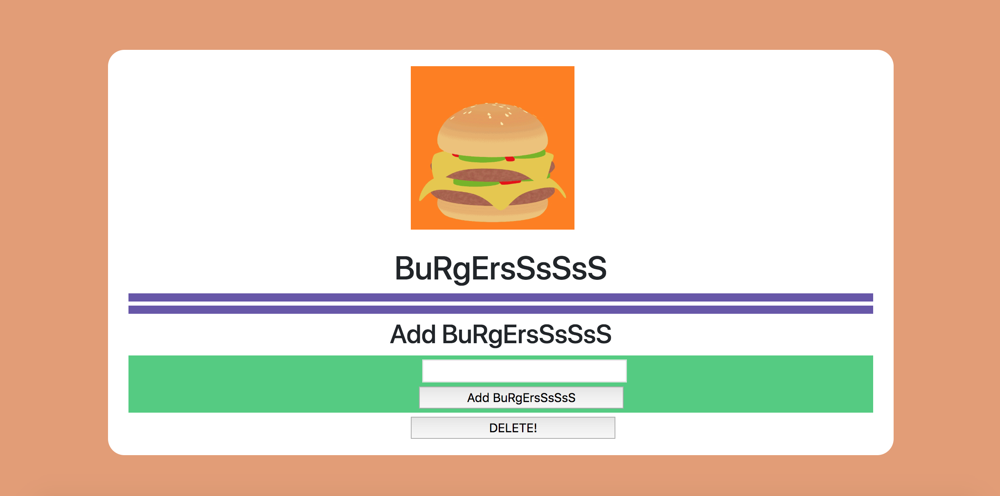

## Eat-Da-Burge ##

This app lets users input the names of burgers they'd like to eat. 

* The following image illstrates:

**Technologies Used**

This app uses:

* Node and Express Servers
* JQuery
* MySQL
* Handlebars
* ORM

**Intructions**

1. git clone git@github.com:sara9551/burger.git

2. Install dependencies --> npm install

3. Run the server --> node server.js

4. Open browseron: http://localhost:8080/

